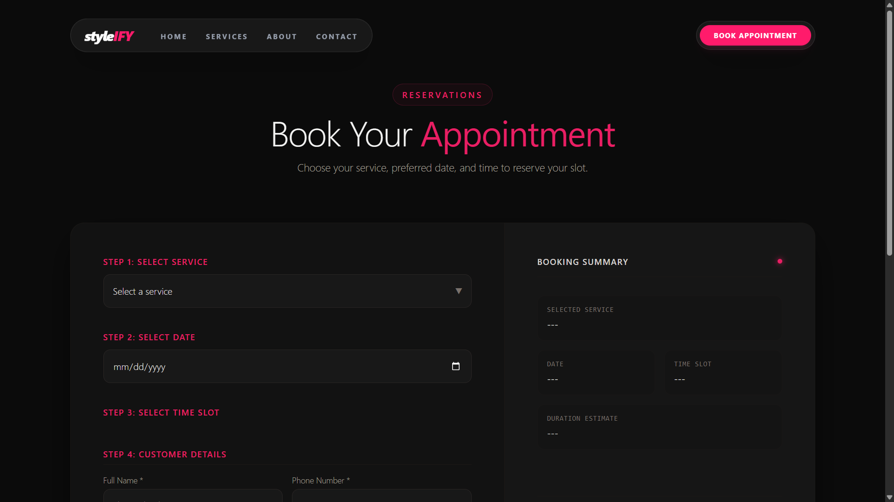

# StyleIFY Salon – Appointment Booking System

StyleIFY is a salon appointment booking web application built with React and Firebase. Developed as a business website demo, it allows customers to explore salon services and book appointments, while providing an admin interface to manage salon operations.

## Live Demo

* **Website:** [StyleIFY Salon](https://style-ify-salon.vercel.app)
* **GitHub Repository:** [StyleIFY Salon](https://github.com/ShrutiChauhan24/styleIFY-salon)

## Features

* Browse salon services and details
* User authentication with Firebase Authentication
* Appointment booking system
* Booking management
* Admin dashboard
* Add, edit and delete salon services
* Manage appointments through the admin interface
* Responsive user interface

## Tech Stack

**Frontend**

* React.js
* JavaScript
* Vite
* Tailwind CSS 
* Framer Motion

**Backend / Services**

* Firebase Authentication
* Cloud Firestore

## Screenshots

### Homepage


### Services


### Appointment Booking




## Project Structure

```text
styleIFY-salon/
├── public/
├──src/
 ├── assets/
 ├── components/
 ├── context/
 ├── helper/
 ├── layout/
 ├── pages/
 ├── App.css
 ├── App.jsx
 ├── ScrollToTop.jsx
 ├── firebase.js
 └── main.jsx
├── .gitignore
├── index.html
├── package.json
├── vite.config.js
└── README.md
```

## Getting Started

### Prerequisites

* Node.js
* npm
* Firebase project configuration

### Installation

1. Clone the repository:

```bash
git clone https://github.com/ShrutiChauhan24/styleIFY-salon.git
```

2. Navigate to the project directory:

```bash
cd styleIFY-salon
```

3. Install dependencies:

```bash
npm install
```

4. Start the development server:

```bash
npm run dev
```

# Firebase Configuration

StyleIFY uses Firebase Authentication and Cloud Firestore.

The Firebase web app configuration is defined in firebase.js and is used to initialize Firebase services.

To run the project with your own Firebase setup:

Create a project in the Firebase Console.
Register a web app and enable Firebase Authentication and Cloud Firestore.
Update the Firebase configuration in firebase.js with your project's web app configuration.
Configure appropriate Firestore Security Rules and authorized domains.

Firebase web app configuration is intended for client-side use. Protect your Firebase resources with proper security rules and API key restrictions where appropriate. Never expose Firebase Admin SDK service-account credentials or private keys.

## Developer

**Shruti Chauhan**
Full-Stack MERN Developer

